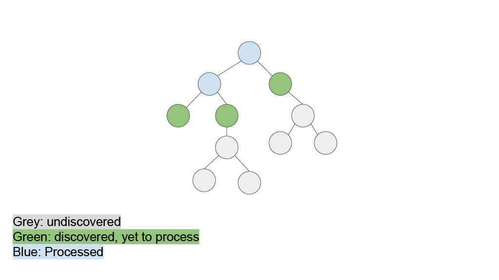
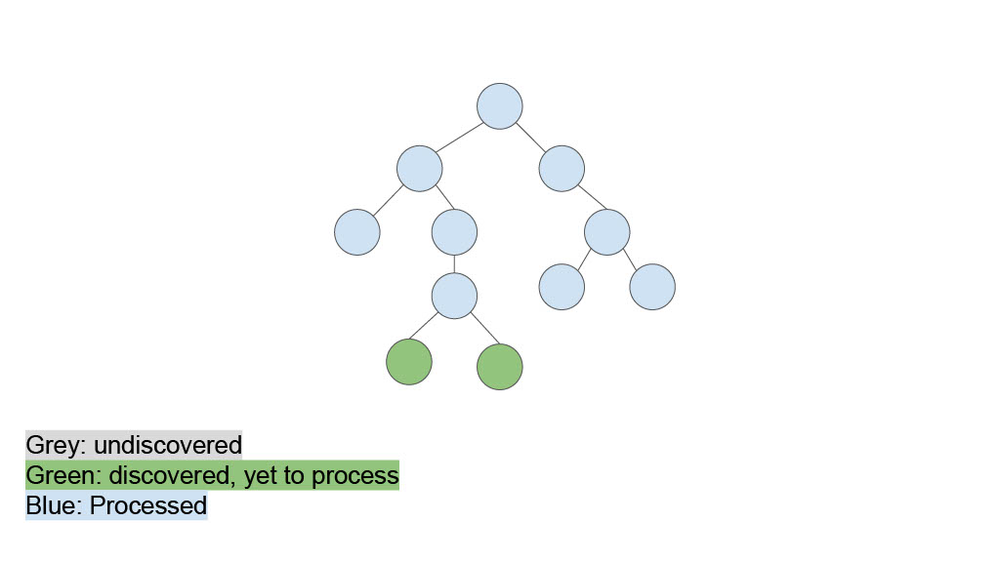
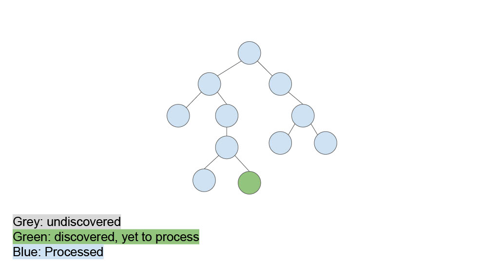
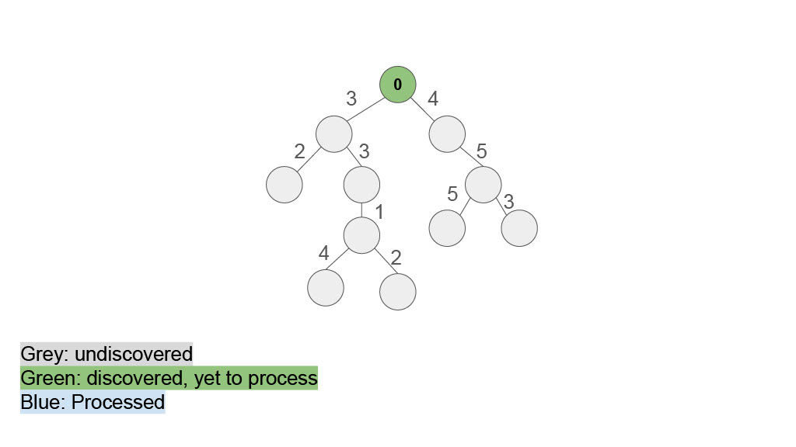
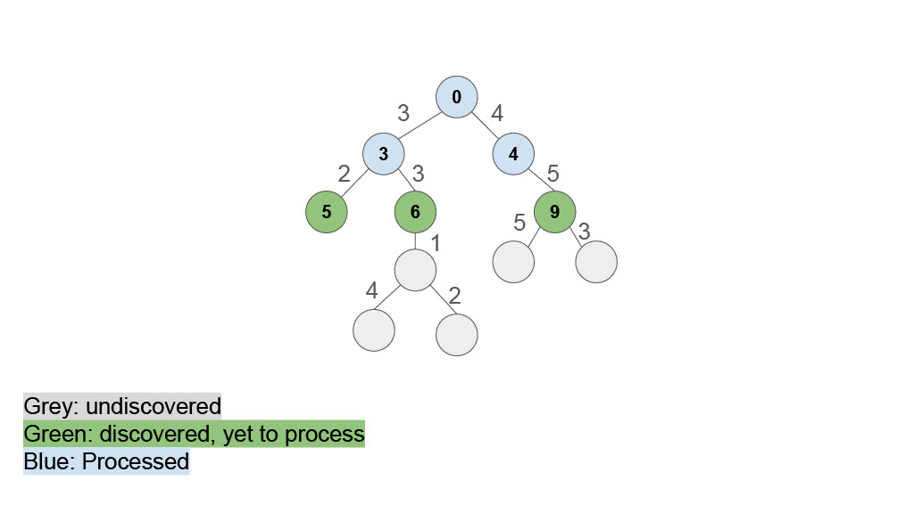
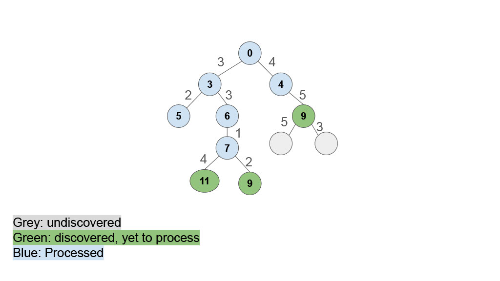
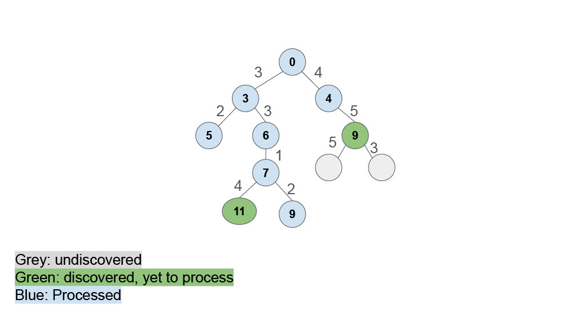

# Graph Search and the Strategy Design Pattern
## Welcome back to CS 2100!
## Prof. Rasika Bhalerao

---

## Strategy pattern

### Finding the shortest path using Uniform Cost Search

Recall Depth first search / recursive backtracking:
- Expand the deepest un-expanded node

If we are searching for the "shortest" path from the root of the tree to each node, it makes more sense to expand the _shallowest_ un-expanded node.

---


---


---


---




---


---


---


---


---


---


---




---




---


---

A Breadth-First Search (BFS) tells us the shortest distance from the root to each node.

If the tree / graph has edges with different weights (or distances), then a variant of BFS called Uniform Cost Search will give us the shortest distance from the root to each node.

---


---




---


---


---




---


---


---




---




---


---


---


---


---

You will not be asked to implement BFS or Uniform Cost Search.
Here is the pseudo-code for Uniform Cost Search:

```
UNIFORM-COST-SEARCH(problem):
    node ← the root, with PATH-COST = 0
    frontier ← a priority queue ordered by PATH-COST, with node as its only element
    explored ← an empty set of nodes
    
    loop until the frontier is empty:
        
        node ← POP(frontier)  // chooses the lowest-cost node in frontier
        if node is the only solution we want, then return it and quit the method
        
        add node to explored
        for each child of node:
            if child is not in explored and child is not in frontier:
                INSERT(child, frontier)
            
            else if child is in frontier, but with a higher PATH-COST:
                replace that node in the frontier with this child
```

---

## Defining distance

Algorithms for "shortest distance" (root to each node, MST) -> must define "distance"

Part of HW9: defining the distance between train stations
- Basic measure of Euclidean distance (used in code)
- Number of minutes it takes to travel: "the station is 15 minutes from here"
- Financial cost of building th track (which is bigger if we have to dig a tunnel underwater or through a mountain)
- `1/n`, where `n` is the number of passengers who regularly travel between the two stations

---

## Strategy pattern

Many definitions of distance, one definition of Uniform Cost Search

Strategy (Duration) Pattern: allow user to choose / change distance definition at run time

<div class="grid grid-cols-2 gap-4">
<div>

##### Ex: Strategies for Tic Tac Toe

- Place a third piece in a row to win
- Block the opponent if they're about to win
- Place in an open corner
- Place in any open square

Strategy for choosing a place changes based on game state

</div>
<div>

##### Ex: maps directions
- Shortest path
- Shortest time
- Least emissions
- Least tolls
- Maximize sightseeing

User chooses the path-finding algorithm at runtime

</div>
</div>

---


---

## Poll: Why do we use composition to hold the Strategy (instead of inheritance through subclasses)?

1. Because subclasses of the Strategy class would not work properly
2. Using inheritance would require methods to copy over the history when we switch strategies (it would need a method for every possible pair of strategies)
3. When we invent a new Strategy, if we were using inheritance, we would need to write methods to copy over the history to/from that new Strategy
4. Um actually, we do use inheritance to extend the Strategy, not composition to hold it​

---

## Example: Algorithms for sorting lists

[Merge Sort](https://en.wikipedia.org/wiki/Merge_sort#/media/File:Merge-sort-example-300px.gif) is most efficient for long lists (O(n log n)​):

1. Split the list in half
2. Sort each half (recursion)
3. Merge the two halves together

[Insertion Sort](https://en.wikipedia.org/wiki/Insertion_sort#/media/File:Insertion_sort.gif) is more efficient for short ( < 30) lists (O(n^2)):

Insert each element into the right position in the list s.t. it's sorted

### Example code to implement this is attached. Let's step with a debugger.

`AdaptiveSorter` chooses the sorting strategy based on list length

---

# Poll:

# 1. What is your main takeaway from today?

# 2. What would you like to revisit next time?