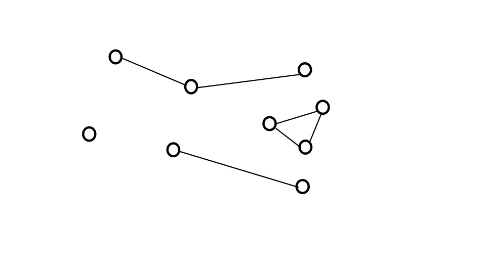
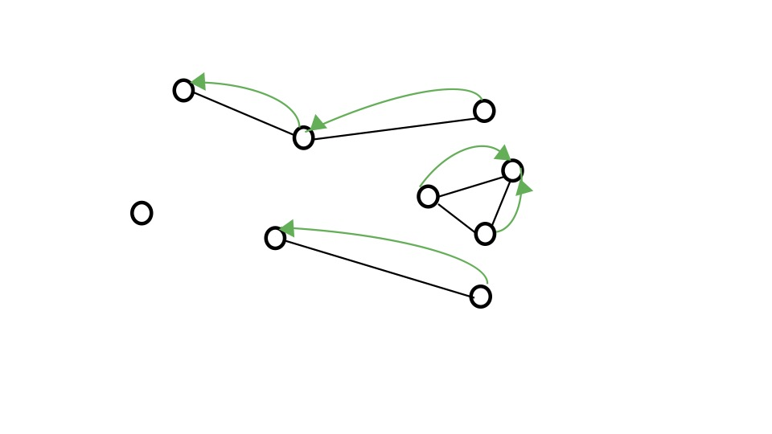
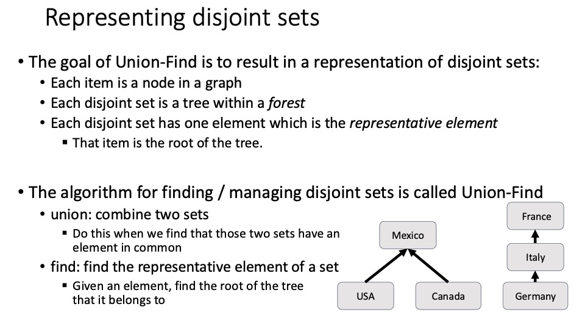
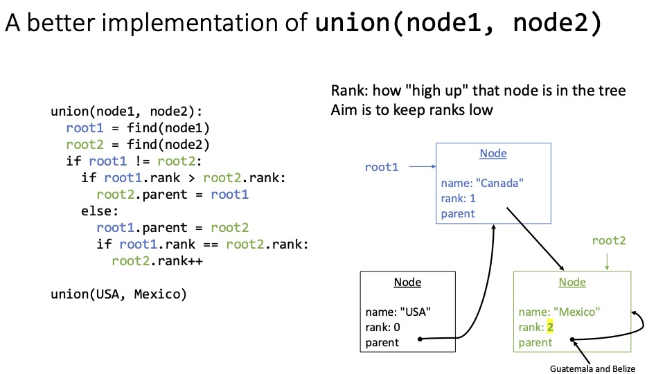

# Union Find
## Welcome back to CS 2100!
## Prof. Rasika Bhalerao

---

# Graphs which might not be trees

- No root or leaves
- Instead of having parent-child relationships:
  - Directed graph: edges point _from_ one node _to_ another
  - Undirected graph: edges do not have a specific direction; all edges go both ways

| Graph term | Definition | Social network example |
|-|-|-|
| Node | Same as tree's node | A person |
| Directed edge | Edge points from one node to another | It's possible Blob is Glob's friend but not vice versa |
| Undirected edge | Edge must go both ways | If Blob is Glob's friend, then Glob must be Blob's friend |

---

<div class="grid grid-cols-2 gap-4">
<div>

```python
class Person:
    def __init__(self, person_id: str):
        self.id = person_id
        self.friends: set[Person] = set()
    
    def __str__(self) -> str:
        return self.id
    
    def __repr__(self) -> str:
        return self.__str__()

class SocialGraph:
    def __init__(self, location: str) -> None:
        self.people: set[Person] = set()
        self.location = location
    
    def __str__(self) -> str:
        return f'People in {self.location}: {self.people}'
```

</div>
<div>


```python
students = SocialGraph('Oakland')

me = Person('Rasika')
students.people.add(me)

mini = Person('Mini')
students.people.add(mini)

me.friends.add(mini)
mini.friends.add(me)

print(students)  # People in Oakland: {Mini, Rasika}

famous_person = Person('Famous')
students.people.add(famous_person)

me.friends.add(famous_person)
mini.friends.add(famous_person)

print(me.friends)  # {Mini, Famous}
print(mini.friends)  # {Rasika, Famous}
print(famous_person.friends)  # set()
```

</div>
</div>

---

## Poll: Is our social media graph above directed or undirected?

1. Directed
2. Undirected

---


---



---



---



---


---


---


---


---


---


---


---


---


---



---


---


---


---

# Poll:

# 1. What is your main takeaway from today?

# 2. What would you like to revisit next time?