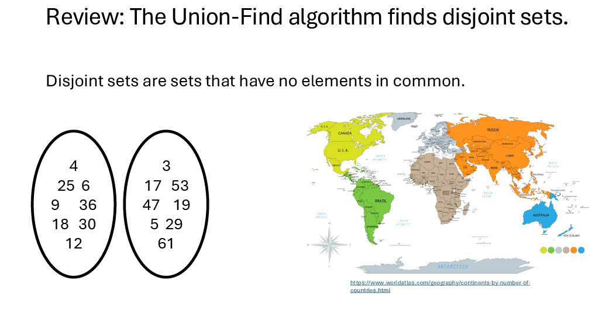
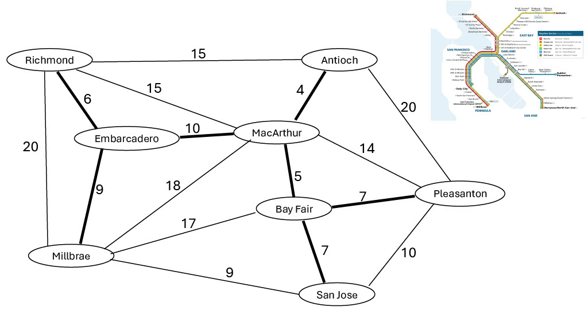
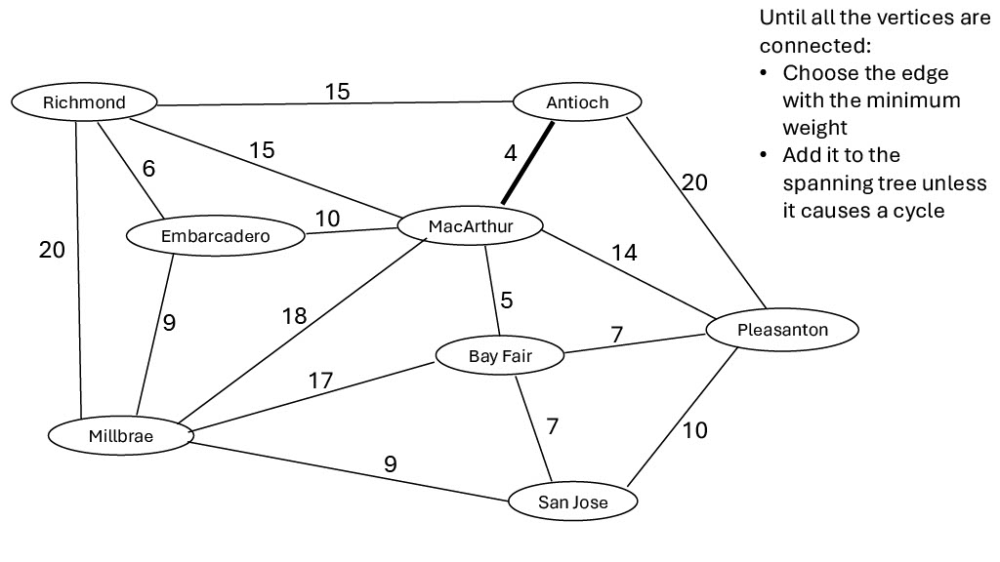
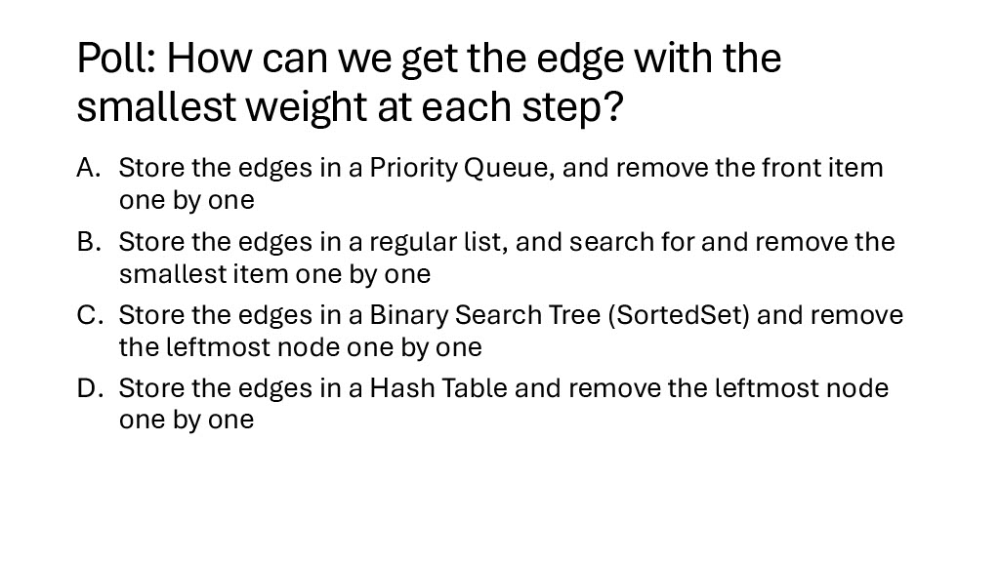
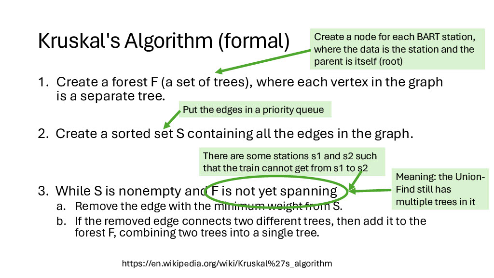
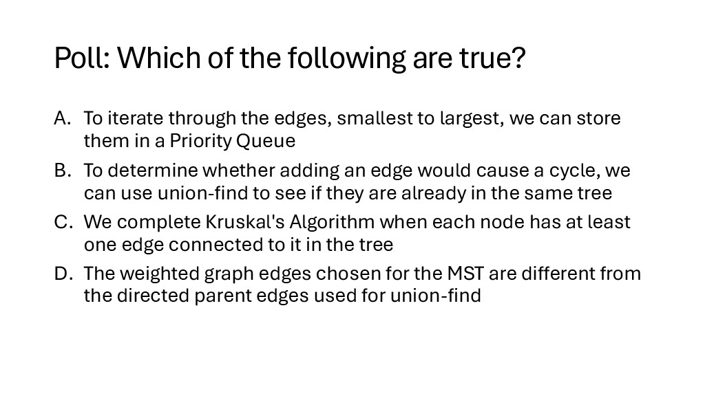

# Minimum Spanning Trees
## Welcome back to CS 2100!
## Prof. Rasika Bhalerao

---



---


---


---


---


---

# New data structure: Priority Queue

Priority queue = a list which stores things in order

Natural order (using `__eq__()` and `__lt__()`, etc), not the order in which they were added

<div class="grid grid-cols-2 gap-4">
<div>


<p><small><small><small><small><small><small>Source: https://www.dreamstime.com/illustration/standing-line.html</small></small></small></small></small></small></p>

</div>
<div>

```python
import heapq

priority_queue: list[int] = []

print(priority_queue)  # []

heapq.heappush(priority_queue, 3)
heapq.heappush(priority_queue, 1)
heapq.heappush(priority_queue, 4)
heapq.heappush(priority_queue, 2)

print(priority_queue)  # [1, 2, 4, 3]
```

</div>
</div>

---

## Priority Queue syntax


```python
smallest = heapq.heappop(priority_queue)  # Remove and return the smallest item
print(smallest)  # 1

print(priority_queue)  # [2, 3, 4]

if priority_queue:  # if it's not empty
    smallest = priority_queue[0]  # Peek at the smallest item without removing it
    print(smallest) # 2

print(priority_queue)  # [2, 3, 4]
```

---

## Poll: What is output?

```python
priority_queue: list[int] = []

heapq.heappush(priority_queue, 5)
heapq.heappush(priority_queue, 3)
heapq.heappush(priority_queue, 6)

print(heapq.heappop(priority_queue))
```

1. 3
2. 5
3. 6

---


---


---


---


---


---




---


---


---


---


---


---




---


---


---


---


---


---


---




---


---


---




---


---


---


---


---


---


---


---


---


---


---


---




---

# Poll:

# 1. What is your main takeaway from today?

# 2. What would you like to revisit next time?