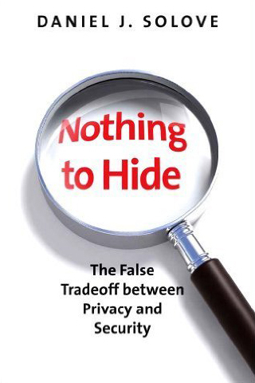

# Quiz 1 Debrief and Ethics
## Welcome back to CS 2100!
## Prof. Rasika Bhalerao

---

# First: let's go over Quiz 1

### Notes for next topic attempt:
- Just because something _can_ have the type `Optional[]`, doesn't mean it _should_

---

# Ethics Lecture learning outcomes:

- Identify pros and cons of using given data to solve the desired problem
- Identify and defend privacy issues
  - Eventually, do this without being told there is a privacy issue to identify
- Identify stakeholders, and values and interests at stake for each stakeholder
  - Identify and discuss conflicts of values
  - Identify modifications that would mitigate conflicts of values

---

# NOT learning outcomes:

- Tell students what to think / which opinions they should hold

---

# The Program Design and Implementation Process

VSD happens at the beginning (helps shape the core functionality)

<!-- Will revisit multiple times this semester, deeper in CS 3100 -->

<!-- Five phases are generally done in order, though it is possible to revisit an earlier phase.

Each phase also has an optional pathway to "Abandon Project." -->

---

## Open-ended poll:
What would happen if we directly jumped to the Implementation phase, skipping the Requirements and Design phases? I.e., what would happen if we started by writing code without first designing the project and planning out its pieces?

---

# Why Value-Sensitive Design?

- Cover the vocabulary for moral language to be able to talk with your teammates and advocate for what you think is right
- To debunk the common excuse of "I have nothing to hide"

---

## Example 1: Social media

Social media apps were built to connect communities.

But there are stakeholders with conflicting values:

- The **social media platform** company makes money when more users look at their content (and advertisements) for longer. **Financial values** -> optimize platform to keep users looking at the screen for longer
- Conflicts with **users**' value of **mental health**

---

## Example 2: Prioritizing viewing

#### Two products:

- reCAPTCHA: verify that users are human
- Duolingo: teach new languages

#### Conflicting stakeholder values:

- Both use data generated by users to train AI models -> unpaid labor
- Duolingo's financial values also compel them to make users view their app more frequently, leading them to prioritize viewing rather than learning.

---

## Steps to demonstrate Value-Sensitive Design in assignments

1. **Identify the stakeholders**: identify people who are affected by the software in any way
2. **Identify the values**: identify the values at stake for those stakeholders when considering the software
3. **Fill out a stakeholder-value matrix**: create a table, where the columns are the values, and the rows are the stakeholders, and write in how each stakeholder's value relates to the software
4. **Identify and analyze conflicts in the matrix**: for each conflict in the matrix, identify whether and how to address it

---

# VSD Case study: Finder, a dating app

Consider “Finder,” a fictitious dating app (such as [Hinge](https://hinge.co/) or [Grindr](https://www.grindr.com/))

Let's:
1. Identify the stakeholders
2. Identify the values
3. Fill out a stakeholder-value matrix
4. Identify and analyze conflicts in the matrix

---

## Step 1: Identify the stakeholders

#### Users:

- nonbinary people
- transgender people
- people who date people of all genders
- people whose sexual orientation is criminalized in their geographic location
- people who are not legally allowed to be in their geographic location altogether
- sex workers
- survivors of intimate partner violence
- people who are blind
- people who don’t speak English
- people whose [names](https://www.kalzumeus.com/2010/06/17/falsehoods-programmers-believe-about-names/) have apostrophes in them

---

## Step 1: Identify the stakeholders

- **content moderators** (subject to viewing harmful content)
- **software engineers** and all the other **employees** of the company which is building Finder

- **advertisers** (if platform has ads)
- **other customers** of the advertising companies
- **actors and influencers** doing the advertising

- **Governments** and **regulators** (following laws and regulations, protecting the public)

- **Anyone who dates** (dating apps have fundamentally changed the way we date)
- relationships formed with Finder will impact many more stakeholders

- [Stakeholders who will get created](https://www.cheaterbuster.com/) over time

---

## Step 2: Identify the values

- **Privacy**: hide their identity from the government, hide their location from an abusive person
- **Safety** separate value or a subset of privacy
- **Fairness**: valued if we prioritize it. We only want to take into account users’ personal preferences, and nothing else, when recommending people as potential dating partners
- **Financial cost** to advertisers and users (depending on Finder’s financial model)
- **Reputation**
- **Laws and regulations**

---

## Step 2: Identify the values

- **Accessibility**: different things to different users
  - Nonbinary people may not have access to Finder if we don’t include them as a gender option
  - People who are blind or who don’t speak English may need us to design Finder so that screen readers and translation apps can work
  - Sex workers are [often unfairly banned](https://drive.google.com/file/d/1JV_0ALmFSrrhISKcWs3LivvcG_ADiYnR/view) from dating apps, even if they are not doing sex work or soliciting clients through the dating app
  - Need to support a large variety of users’ names so that they can create profiles

---

## Step 3: Fill out a stakeholder-value matrix

Matrix:
- columns represent the values
- rows represent the stakeholders
- cells describe how each stakeholder interacts with each value

---

| | Privacy | Accessibility | Fairness | Financial cost | Reputation | Laws and regulations | Hope of finding connection|
|-|-|-|-|-|-|-|-|
| People with criminalized sexual orientations | Hide sexual orientation from government  | Able to search profiles of appropriate genders | Should be recommended fairly | Keep costs reasonable | | Generally want to exist legally | Want to find connection |
| Survivors of intimate partner violence | Keep location hidden | 2FA etc. to prevent account takeover | | | | Hope we go above minimum regulations for accommodation and protection | |

---

| | Privacy | Accessibility | Fairness | Financial cost | Reputation | Laws and regulations | Hope of finding connection|
|-|-|-|-|-|-|-|-|
| People who are blind |  | Screen readers | | | | | |
| People who are not allowed in their location | Keep location hidden from gov't | Set up profile without gov't ID | | | | | |

---

| | Privacy | Accessibility | Fairness | Financial cost | Reputation | Laws and regulations | Hope of finding connection|
|-|-|-|-|-|-|-|-|
| People who don’t speak English | Avoid surveillance | Able to use translation apps  |  |  |  |  |  |
| People whose names have apostrophes |  | Able to set up a profile |  |  |  |  |  |

---

| | Privacy | Accessibility | Fairness | Financial cost | Reputation | Laws and regulations |
|-|-|-|-|-|-|-|
| Content moderators | Avoid leaking identity | Access to what they need, nothing more | Training to ensure consistency | Compensated for seeing harmful content | Uphold company reputation | Laws about speech and personal data |
| Advertisers | Hide financial details, etc. | Want users’ contact information |  | Reach more audiences for less money | Be seen on good platforms | Follow regulations |

<!-- ---

| | Privacy | Accessibility | Fairness | Financial cost | Reputation | Laws and regulations |
|-|-|-|-|-|-|-|
| Actors and influencers | Avoid leaking personal info |  | Shown to users fairly | Fair compensation | Be seen with good products and platforms |
| Other customers of advertisers  | Likely want to avoid leaking personal info to users  | If the ads have special deals, then the other customers lose out on those deals |  |  |  |  |
| Governments and regulators | Likely want to avoid leaking their identities to users  | Need access to everything they need, and nothing more   |   | Need to collect accurate taxes |  | Must enforce the law |
| General public | Likely want to avoid leaking personal info to users | Probably no access to the app unless they sign up as users |  | Competition drives costs up |  |  | -->

---

## Step 4: Identify and analyze conflicts in the matrix

- Advertisers want to keep financial costs low, but that may push the financial cost onto the users or the company building Finder
  - Must choose one over the other

- Users want to keep identities / locations private from the gov't, but gov't may want access to that info to enforce laws / protect the public
  - Keep all information private until regulators subpoena
  - Only provide specific info to gov't (not location / sexual orientation)

---

## Step 4: Identify and analyze conflicts in the matrix

- Fairness or accessibility can sometimes unfortunately require risking Finder’s reputation, depending on the audience giving reputation-related opinions / how strongly they feel that others don’t belong
  - Personally, I think fairness would increase reputation among the right audiences

- Ensuring fairness for users can require collecting personal information, which can then compromise privacy
  - Find a balance of which info to collect
  - Don't share that info (only use it to ensure fairness)

- Criminalized populations want to exist despite being targeted by gov't
  - Don't share info with gov't unless absolutely legally required

---

## Bias and Unfairness (throughout the process)

- We will not solve society's issues with a VSD matrix
  - That's a more challenging and continuous process
- But we can mitigate bias and unfairness in our technology

---

## How bias and unfairness enter our technology

- Tech relies on dataset that doesn’t reflect stats of the population it represents
  - E.g. dataset of "the general population" includes zero women
- Tools used to collect data are biased
  - E.g. survey has multiple-choice questions that are impossible to answer correctly
- Technologists misunderstand the data
  - E.g. they don't understand the context in which the data was collected -> dismiss important data points / select the wrong variables
- Technologists make mistakes
  - E.g. many reports of fraud in September -> technologists assume the start of an academic year causes students to commit fraud
- Tech is used for a different purpose than the one for which it was built
  - E.g. platform for communication in vulnerable communities is used to harass them

---

## Bias and unfairness can be created or amplified once the technology is implemented in a particular societal context.

- Tech reflects historical injustices as they unfold and compound
  - E.g. word representations reflect the bias of text on which they are trained
- Users have implicit biases, and tech exacerbates the impact of those biases
  - E.g. it reinforces stereotypes
- Tech has disparate impact given the social context and features outside the model
  - E.g. a tool that is very useful to one population may be harmful or inaccessible to another population
- Unfairness is compounded through feedback loops
  - E.g. social media highlights posts which have already received attention

---

## Polls: Your Case Study: Algorithmic hiring

"Shamazon" (a fictitious company) is looking to hire software engineers, and you have been tasked with designing a tool to filter the submitted resumes and select the ideal candidates for hire.

- Who are the stakeholders?
- What are the values?
- What is in the stakeholder-value matrix?
- What are the conflicts in the matrix? And how can we mitigate them?
- Where are bias and unfairness entering the product? And how can we mitigate them?

---

# Privacy

Privacy is
> the ability to determine for ourselves when, how, and to what extent information about us is communicated to others

(Westin, 1967, as summarized in DeCew 2018)

But,
> individual privacy often appears to be in conflict with the interests of society or the state: a balance must be struck between public and private interests. For example, people describe a 'tradeoff' between privacy and national security. If privacy is _only_ understood in this way, privacy often loses.

([Dr. Katie Creel](https://kathleenacreel.com/))

---

# Privacy

So...
- We make decisions about privacy using social models and context
- Help us determine the right tradeoffs

---

# Privacy

Here are the questions that we use throughout this course to help us make those decisions:

| Question | Answer |
| - | - |
| What type of information is shared? |  |
| Who is the subject of the information? |  |
| Who is the sender of the information? |  |
| Who are the potential recipients of the information? |  |
| What principles govern the collection and transmission of this information? |  |

---

## Privacy Case study: Gaggle, a messaging app for schools

Gaggle, an online platform designed for use in the classroom that seeks to replace communcation tools such as blogging software and email clients with similar software equipped with content filters, states that "Gaggle will not distribute to third parties any staff data or student data without the consent of either a parent/guardian or a qualified educational institution except in cases of Possible Student Situations (PSS), which may be reported to law enforcement."

Imagine that a student sent a message to another student at 8pm on a Saturday and Gaggle flagged it as a potential indicator that the student is depressed.

---

## Privacy Case study: Gaggle, a messaging app for schools

# What type of information is shared?

## Student data (the message, sender, recipient, timestamp, location)

# Who is the subject of the information?

## The student and their mental health concerns

---

## Privacy Case study: Gaggle, a messaging app for schools

# Who is the sender of the information?

## The student

# Who are the potential recipients of the information?

### The other student and Gaggle. If Gaggle alerts the parents, school administration, or law enforcement, then they will also become recipients.

Potential recipients of the information include unintended recipients, such as people looking over the shoulder of school administrators, or any students or teachers who notice the contacting of law enforcement.

---

# What principles govern the collection and transmission of this information?

## "Gaggle will not distribute to third parties any staff data or student data without the consent of either a parent/guardian or a qualified educational institution except in cases of Possible Student Situations (PSS), which may be reported to law enforcement."

---

## Polls: Your Case Study: Algorithmic hiring

“Shamazon” (a fictitious company) is looking to hire software engineers, and you have been tasked with designing a tool to filter the submitted resumes and select the ideal candidates for hire.

| Question | Answer |
| - | - |
| What type of information is shared? |  |
| Who is the subject of the information? |  |
| Who is the sender of the information? |  |
| Who are the potential recipients of the information? |  |
| What principles govern the collection and transmission of this information? |  |

---

# Poll:

# 1. What is your main takeaway from today?

# 2. What would you like to revisit next time?