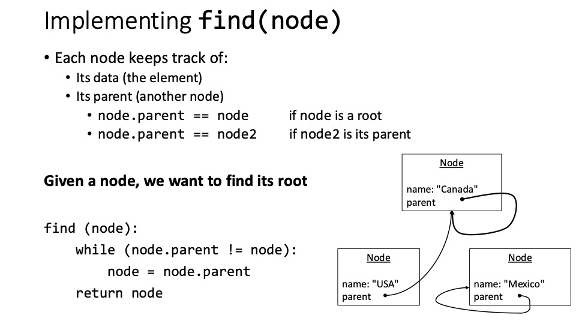
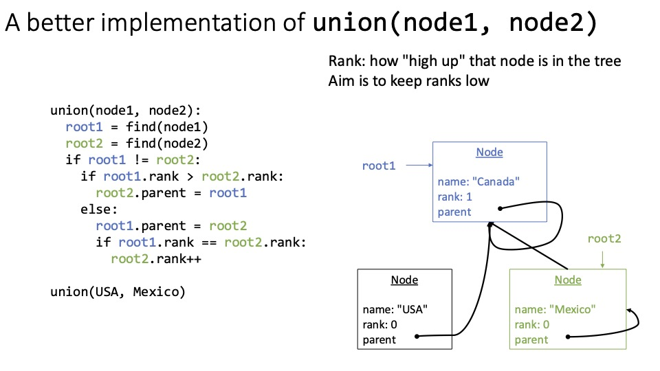
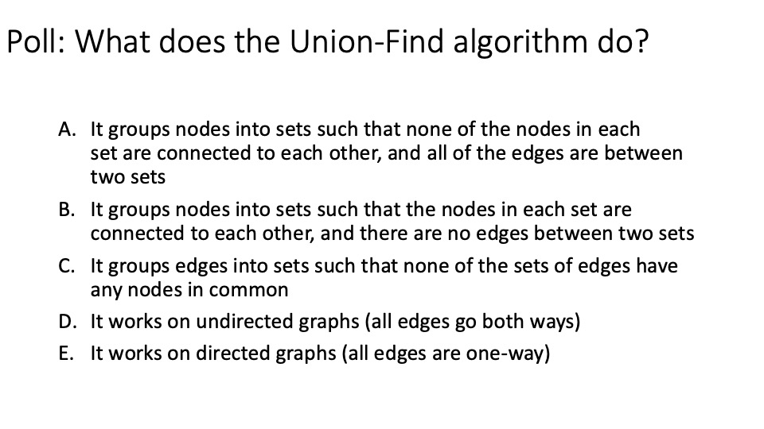

# Graphs and Union-Find
## Welcome back to CS 2100!
## Prof. Rasika Bhalerao

---

Let's use recursion to search for an element in a `Tree`:

```python
class Tree(Generic[T]):
    def __init__(self, root_data: Optional[T] = None) -> None:
        if root_data is None:
            self.root: Optional[Node[T]] = None
        else:
            self.root = Node[T](root_data)
    
    def __str__(self) -> str:
        return self.root.__str__()
    
    def __contains__(self, item: T) -> bool:
        return self.contains(item, self.root)
    
    def contains(self, item: T, node: Optional[Node[T]]) -> bool:
        if node is None:
            return False
        elif node.data == item:
            return True
        else:
            return self.contains(item, node.left) or self.contains(item, node.right)

tree: Tree[str] = Tree[str]('Entry way')

assert tree.root is not None
tree.root.left = Node[str]('Living room')

tree.root.left.right = Node[str]('Kitchen')

print('Kitchen' in tree)  # True
print('Bathroom' in tree)  # False
```

---


---


---


---


---


---


---


---


---


---


---


---


---


---


---


---


---


---


---

# That recursive backtracking algorithm is called **Depth-First Search**, since it explores "deep" in one area before moving on to other unexplored "shallow" places (closer to the root).


---

## Poll: This is pseudocode for a Depth-First Search on a graph that is not a tree (because it has cycles). What's a good base case?

```
DFS(node):
    Base case:
        ???
    Recursive case:
        For each child:
            Add child to explored nodes
            DFS(child)
```
1. If the node is in the set of explored nodes, do nothing
2. If the node is a leaf, add it to the set of explored nodes
3. If the node is `None`, do nothing
4. If the node is `None`, add it to the set of explored nodes

---

# Graphs which might not be trees

- No root or leaves
- Instead of having parent-child relationships:
  - Directed graph: edges point _from_ one node _to_ another
  - Undirected graph: edges do not have a specific direction; all edges go both ways

| Graph term | Definition | Social network example |
|-|-|-|
| Node | Same as tree's node | A person |
| Directed edge | Edge points from one node to another | It's possible Blob is Glob's friend but not vice versa |
| Undirected edge | Edge must go both ways | If Blob is Glob's friend, then Glob must be Blob's friend |

---

<div class="grid grid-cols-2 gap-4">
<div>

```python
class Person:
    def __init__(self, person_id: str):
        self.id = person_id
        self.friends: set[Person] = set()
    
    def __str__(self) -> str:
        return self.id
    
    def __repr__(self) -> str:
        return self.__str__()

class SocialGraph:
    def __init__(self, location: str) -> None:
        self.people: set[Person] = set()
        self.location = location
    
    def __str__(self) -> str:
        return f'People in {self.location}: {self.people}'
```

</div>
<div>


```python
students = SocialGraph('Oakland')

me = Person('Rasika')
students.people.add(me)

mini = Person('Mini')
students.people.add(mini)

me.friends.add(mini)
mini.friends.add(me)

print(students)  # People in Oakland: {Mini, Rasika}

famous_person = Person('Famous')
students.people.add(famous_person)

me.friends.add(famous_person)
mini.friends.add(famous_person)

print(me.friends)  # {Mini, Famous}
print(mini.friends)  # {Rasika, Famous}
print(famous_person.friends)  # set()
```

</div>
</div>

---

## Poll: Is our social media graph above directed or undirected?

1. Directed
2. Undirected

---


---


---


---


---


---


---


---



---


---


---


---



---


---


---


---



---


---

# Poll:

# 1. What is your main takeaway from today?

# 2. What would you like to revisit next time?