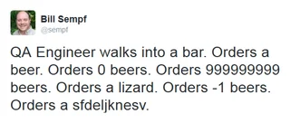

# Designing Classes and Tests
## Welcome back to CS 2100!
## Prof. Rasika Bhalerao

---

<div class="grid grid-cols-2 gap-4">
<div>

```python
def sarcasm(phrase: str) -> str:
    """Returns the sarcastic version 
    of the provided phrase, where a 
    randomly selected half of the 
    characters are uppercase, and 
    the others are lowercase.

    Parameters
    ----------
    phrase : str
        The phrase to turn sarcastic
    Returns
    -------
    str
        The sarcastic version of 
        the phrase
    """
    sarcastic_phrase = ''
    for character in phrase:
      if random() < 0.5:
        sarcastic_phrase += 
            character.upper()
    return sarcastic_phrase
```

</div>
<div>

## We did this poll last time: What's wrong? Why doesn't the docstring match the code?

1. It's adding the index of the character, not the character itself
2. It skips adding about half of the letters
3. Sometimes, it doesn't return a string at all
4. It adds extra characters to the string

</div>
</div>

---

# Iteration: for loops over a collection, keeping track of indices

```python
for index, word in enumerate(['American Shorthair', 'Balinese', 'Cheetah']):
    print(f'{index}: {word}')

>> 0: American Shorthair
   1: Balinese
   2: Cheetah
```

---

# Read and write data from text files

Read data from a file:

```python
with open('story.txt', 'r', encoding="utf-8") as file:
    for line in file.readlines():
        print(line)
```

Write to a file instead of reading --> use an option other than `'r'`:

- `open('story.txt', 'r')`: read the file
- `open('story.txt', 'w')`: write the file (overwrite it if it already exists)
- `open('story.txt', 'a')`: append to the end of the file (and create the file if it doesn't exist)

Write to the file using `file.write("Line to write to file")`.

---

# Import code

Import modules like `import unittest` and `from typing import List, Set`

Can also import code from a file that we wrote ourselves: `import my_file`

When a Python file is imported, all of the code inside it is executed. That's why we put our code inside functions -- we don't want the code inside to be executed when it's imported!

Call all the functions in `main()` and add this at the end of the file:

```
if __name__ == '__main__':
    main()
```

---

# Import code: trying it out in lecture

1. Put `print('hello')` in a new file, import it in this file, and run this file (where it is imported)
2. Move it to inside a function and run it
3. Add the `if __name__ == '__main__'` conditional at the end and run it
4. Run this file (where it is imported) to make sure it doesn't print

---

# Classes

- "nouns" (versus functions which are "verbs")
- encapsulate data and code
- achieve abstraction (mask details of implementation)
  - e.g., like how we push a button/turn a key to start a car without knowing how exactly it works
- Allow us to create our own new custom _type_

Here are some classes that are built in to Python (types that we already use):

| Class (data type) | Object (an instance of a class) |
| ----------------- | ------------------------------- |
| str | word: str = "hello" |
| list | items: List[int] = [1, 2, 3] |

---

## How to make a class

<div class="grid grid-cols-2 gap-4">
<div>

- Class header is `class​ Name:` (capital letter)
- Methods: functions inside a class​
  - First parameter is `self`
- Attributes: variables shared among all methods
  - Name starts with `self.`
- Constructor: special method that is called when the object is "instantiated"
  - To initialize the attributes
  - `def __init__(self, <args>):`

</div>
<div>

```python
class Pet:
    """Represents a household pet"""

    def __init__(self, 
            pet_name: str, 
            owner_name: str, 
            animal: str):

        self.name: str = pet_name
        self.owner: str = owner_name

        if animal == 'cat':
            self.sound: str = 'meow'
        elif animal == 'dog':
            self.sound = 'bark'
        else:
            self.sound = 'hello'

    def make_sound(self) -> str:
        """Returns the pet's sound"""
        return self.sound
```
</div>

---

<div class="grid grid-cols-2 gap-4">
<div>

```python
class Pet:
    """Represents a household pet"""

    def __init__(self, 
            pet_name: str, 
            owner_name: str, 
            animal: str):
            
        self.name: str = pet_name
        self.owner: str = owner_name

        if animal == 'cat':
            self.sound: str = 'meow'
        elif animal == 'dog':
            self.sound = 'bark'
        else:
            self.sound = 'hello'

    def make_sound(self) -> str:
        """Returns the pet's sound"""
        return self.sound
```
</div>
<div>

- Instantiate an object (an instance) by putting parentheses after its name with the constructor's args
- Call its methods using the "dot operator" (`.`)

Below:
1. Instantiate a `Pet` variable called `mini`
2. Call `mini`'s `make_sound()` method
  
```python
mini: Pet = Pet(
    'Mini', 'Rasika', 'cat'
)
print(mini.make_sound())
```
</div>

---

Exercise: Let's define a class called `Cat`

- Attributes: self.name, self.age
- Constructor:
  - Take name as parameter
  - Make self.age equal 0
- Methods:
  - `birthday()` increments `self.age`
  - `make_sound()` returns the string `'meow'`, multiplied by the cat's age (with spaces in between)

---

Solution:

```python
class Cat:
    """Represents a cat with a name"""
    def __init__(self, name: str):
        self.name = name
        self.age = 0
    
    def birthday(self) -> None:
        """Increments cat's age"""
        self.age += 1
    
    def make_sound(self) -> str:
        """Returns 'meow' multiplied by cat's age, with spaces in between"""
        return ('meow ' * self.age).strip()
```

---

## Poll: What does this output?

```python
mini: Cat = Cat('Mini')
for year in range(3):
    mini.birthday()
print(mini.make_sound() + Cat('Mega').make_sound())
```

1. meow meow meow
2. (blank line)
3. Mini Mini Mini Mega
4. Mini Mega

---

# We give each class a corresponding test class

<!-- We saw an example of this in Lecture 1. We can organize our tests -- each class gets its own corresponding test class, where we test all of its methods. -->

1. To write tests for a class named `Class`, create a class called `TestClass(unittest.TestCase)`
2. Put all the tests for `Class` inside `TestClass`
    <!-- - `unittest.TestCase` contains a bunch of helpful methods that we inherit -->
    - `self.assertEqual()` takes two args. If they are equal, it does nothing. If they are not equal, it raises an error
    - `self.assertAlmostEqual()` allows a small difference if used for `float`s
    - `self.assertRaises()` takes an error as an argument, and does nothing if the block of code raises that error. Else raises `AssertionError`
    - The name of each method that has tests in it should start with `test_`
3. Then outside of `TestClass`, call `unittest.main()`
  <!-- - Optional verbosity parameter can be 1, 2, or 3 -->
4. Don't forget to `import unittest` at the top of the file

<!-- `with self.assertRaises(ValueError): get_area_of_rectangle(-1, 4)` -->

---

## Exercise: Let's write tests for `Cat`

---

# Identifying test cases

For this course, we write tests for every function or method.

Consider all the ways the function might behave:

- Normal / happy case (expected inputs)
  - `assertEqual(5, add(2, 3))`
  - `assertNotEqual(1, add(2, 3))`
  - `assertEqual('A', calculateGrade(96))`
- Invalid inputs
  - `with self.assertRaises(ValueError): calculateGrade(-600)`
  - `with self.assertRaises(ValueError): add('two', 3)`
  - `with self.assertRaises(ValueError): get_area_of_rectangle(-1, 4)`

---

# Identifying test cases

- Edge cases at the boundaries (almost invalid, but not quite)
  - `assertEqual(0, get_area_of_rectangle(0, 4))`
  - `assertEqual(0, divide(0, 1))`

If the function has conditionals, make sure to have test cases for each branch.

---

## Poll: We're testing a function `calculateGrade(score: int) -> str` that returns a letter grade given a percentage. Which test case is MOST important to include?

1. `assertEqual('B+', calculateGrade(87))`
2. `assertEqual('F', calculateGrade(0))`
3. `with self.assertRaises(ValueError): calculateGrade(-600)`
4. All of these are equally important

---

<!-- ## Open ended poll: What other test cases can you come up with? -->




<!-- footer: Source: https://www.reddit.com/r/QualityAssurance/comments/3na0fq/qa_engineer_walks_into_a_bar -->

---

## Poll: What's wrong with this test?
```python
def test_make_sound_works_after_four_years(self) -> None:
    self.assertEqual("", Cat('giga').make_sound())
```
1. The test runs, but it fails (that's not how the implementation is supposed to work)
2. Not all of the tests in this function always get executed
3. The function's name doesn't reflect what it tests
4. It's using the wrong type of test

<!-- footer: . -->

---

## Poll: What's wrong with this test?
```python
def test_make_sound_works_during_first_four_years(self) -> None:
    large: Cat = Cat('large')
    meows: str = ""
    for _ in range(4):
        self.assertEqual(meows, large.make_sound())
        large.birthday()
        meows = (meows + " meow").strip()
```
1. The test runs, but it fails (that's not how the implementation is supposed to work)
2. Not all of the tests in this function always get executed
3. The function's name doesn't reflect what it tests
4. It's using the wrong type of test

---

## Poll: What's wrong with this test?
```python
def test_negative_area(self) -> None:
    with self.assertRaises(ValueError):
        self.assertEqual(-400, get_area_of_rectangle(-4, 100))
```
1. The test runs, but it fails (that's not how the implementation is supposed to work)
2. Not all of the tests in this function always get executed (it is possible for some tests to not run)
3. The function's name doesn't reflect what it tests
4. It's using the wrong type of test

---

# Using setUp and tearDown

`unittest` comes with methods that reduce redundancy / write cleaner tests:

- `def setUp(self) -> None:` runs before each test
- `def tearDown(self) -> None:` runs after each test
- `def setUpClass(cls) -> None:` runs once before any tests have run
- `def tearDownClass(cls) -> None:` runs once after all tests have run

Notes about `setUpClass(cls)` and `tearDownClass(cls)`:
- Need decorator `@classmethod` above the method
- arg is `cls`, not `self`

---

### Poll: Why does this break? Why is it better to use `setUp()`?

```python
class TestShirt(unittest.TestCase):
    def __init__(self) -> None:
        self.shirt = Shirt(500, 'green')
    
    def test_set_size_works_for_positive_values(self) -> None:
        self.shirt.set_size(600)
        self.assertEqual(600, self.shirt.size)
    
    def test_cannot_set_size_to_negative_value(self) -> None:
      self.assertEqual(500, self.shirt.size)
      self.shirt.set_size(-700)
      self.assertEqual(500, self.shirt.size)
```

1. It unnecessarily tests the same thing multiple times
2. It requires the tests to be run in a certain order, which is not guraranteed
3. It doesn't test what the name implies it is testing
4. It is possible for some tests to not be run

---

# Using `try` / `except` safely

A control structure that we have not introduced until now:

```python
a: int = 4
b: int = 0

try:
    result = a / b
    print(result)
except ZeroDivisionError:
    print("Cannot divide by zero")
```

- Allows us to try to run risky code
- If an error is raised during that risky code, it jumps to the corresponding `except` block

- Only use it when absolutely necessary -- do not avoid fixing bugs with `try`

---

# Places where `try` / `except` is commonly used:

<div class="grid grid-cols-2 gap-4">
<div>

- Converting values
```python
def get_user_age() -> int:
    """Get a numerical age from the user"""
    user_input: str = input("Enter your age: ")
    try:
        age: int = int(user_input)
        return age
    except ValueError:
        print("Please enter a valid number")
        return -1
    
def parse_json_safely(json_string: str) -> Any:
    """Convert data from JSON to a readable format"""
    try:
        return json.loads(json_string)
    except json.JSONDecodeError as e:
        print(f"Invalid JSON: {e}")
        return {}
```

</div>
<div>

- Operations that rely on external things like network requests or database operations
- File I/O (though `with` is better)
- `try` / `except` is an acceptable alternative to the built-in `self.assertRaises()`

</div>
</div>

---

# Keywords in a `try` / `except` block:
- Each error type gets its own `except`
  - Error types as specific as possible (`ValueError`, not `Error`)
  - Okay to have multiple `except`s for the same `try`
  - One `except` block can handle multiple errors, if they require the same process: `except (ValueError, TypeError) as e:`
- Inside an `except` block, we may choose to `raise` a different error
- If there is a `finally` at the end, it is always run (whether the `try` was fully executed, or it jumped to the `except`)
- If there is an `else` at the end, then it is run only if the `try` was fully successful

---

## Poll: What is output?
```python
def noodle(hopefully_a_number: str) -> None:
    try:
        num: int = int(hopefully_a_number)
        print('Cats rule')
    except AssertionError as e:
        print(f'{hopefully_a_number} is not a number')

noodle('hello')
```

1. Cats rule
2. hello is not a number
3. Cats rule
   hello is not a number
4. No output - it raises the error

---

## Poll: What is output?
```python
def noodle(hopefully_a_number: str) -> None:
    try:
        num: int = int(hopefully_a_number)
        print('Cats rule')
    except ValueError as e:
        print(f'{hopefully_a_number} is not a number')

noodle('hello')
```

1. Cats rule
2. hello is not a number
3. Cats rule
   hello is not a number
4. No output - it raises the error

---

# Poll:

# 1. What is your main takeaway from today?

# 2. What would you like to revisit next time?