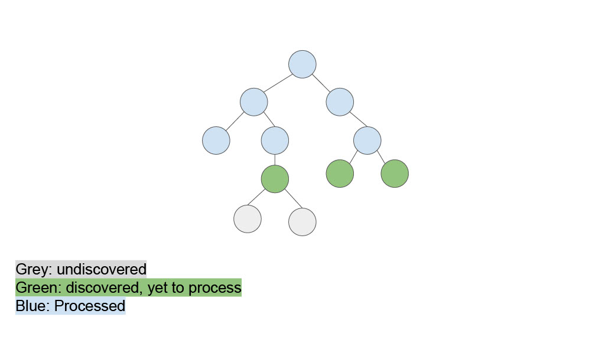
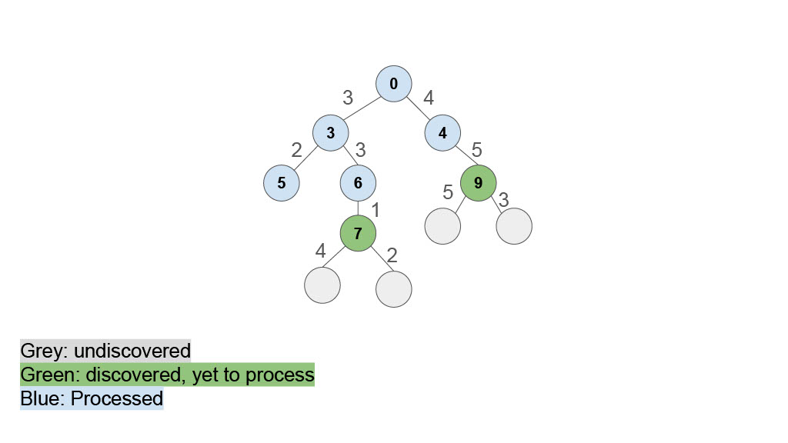

# Design patterns: Strategy, Observer, and "Data Pull"
## Welcome back to CS 2100!
## Prof. Rasika Bhalerao

---

# Design Patterns

Already covered a few _design patterns_: structures or templates that software engineers have agreed solve common software problems

- [Lists](https://neu-pdi.github.io/cs2100-public-resources/lecture-notes/l11-lists#the-accumulator-pattern): Accumulator Pattern (add up, or _accumulate_, a sequence of items)
- [design patterns for handling data](https://neu-pdi.github.io/cs2100-public-resources/lecture-notes/l15-design-data1): mapping, filtering, and merging dataframes

## Design patterns:
- are independent of programming language
- are flexible (the overarching pattern allows modifications)
- provide us a common vocabulary to communicate "blueprints" for standard patterns

---

# "Data Pull" pattern

Modeled after this lecture: https://neu-se.github.io/CS4530-Spring-2024/Slides/Module%2005%20Interaction-Level%20Design%20Patterns.pdf

---

## Information transfer: push versus pull

Producer produces some data, Consumer uses that data:

```python
class Producer:
    def get_data(self) -> int:
        return 500

class Consumer:
    def do_some_work(self) -> None:
        self.do_something(self.needed_data)

    def do_something(self, data: int) -> None:
        # Placeholder for actual work
        pass
```

How can we get the data from the producer to the consumer?

---

## "Data pull" pattern: consumer asks producer

<div class="grid grid-cols-2 gap-4">
<div>

```python
class Producer:
    def get_data(self) -> int:
        return 500

class Consumer:
    def __init__(self, producer: Producer):
        self.producer = producer

    def do_some_work(self) -> None:
        needed_data = self.producer.get_data()
        self.do_something(needed_data)

    def do_something(self, data: int) -> None:
        # Placeholder for actual work
        pass
```

</div>
<div>


- Consumer knows about producer
- Producer has a method that consumer can call
- Consumer asks producer for the data

</div>
</div>

---

<div class="grid grid-cols-2 gap-4">
<div>

# Example: Clock using "Data pull" pattermn

```python
class IPullingClock(ABC):
    @abstractmethod
    def reset(self) -> None:
        """Sets the time to 0."""
        pass

    @abstractmethod
    def tick(self) -> None:
        """Increments the time."""
        pass

    @abstractmethod
    def get_time(self) -> int:
        """Returns the current time."""
        pass
```

</div>
<div>

`SimpleClock` (producer) implements `IPullingClock` interface, `ClockClient` is consumer:

```python
# Producer
class SimpleClock(IPullingClock):
    def __init__(self) -> None:
        self.time = 0

    def reset(self) -> None:
        self.time = 0

    def tick(self) -> None:
        self.time += 1

    def get_time(self) -> int:
        return self.time

# Consumer
class ClockClient:
    def __init__(self, the_clock: IPullingClock):
        self.the_clock = the_clock

    def get_time_from_clock(self) -> int:
        return self.the_clock.get_time()
```

</div>
</div>

---

# Observer pattern

### Potential problem with the "data pull" clock example:

What if the clock ticks once per second, but there are dozens of clients, each asking for the time every 10 msec?

Our clock might be overwhelmed!

Can we do better for the situation where the clock updates rarely, but the clients need the values often?

---

## Observer pattern: producer tells consumer ("push")

<div class="grid grid-cols-2 gap-4">
<div>

```python
class Consumer:
    def __init__(self) -> None:
        self.needed_data = 0

    def receive_notification(
        self, data_value: int
    ) -> None:
        self.needed_data = data_value

    def do_some_work(self) -> None:
        self.do_something(self.needed_data)

    def do_something(self, data: int) -> None:
        # Placeholder for actual work
        print(
            f"Doing something with data: {data}")
```

</div>
<div>


```python
class Producer:
    def __init__(
        self, consumer: Consumer
    ) -> None:
        self.consumer = consumer
        self.the_data = 0

    def update_data(
        self, input_value: int
    ) -> None:
        self.the_data = \
            self.do_something_with_input(
                input_value)
        # notify the consumer about the change:
        self.consumer.receive_notification(
            self.the_data)

    def do_something_with_input(
        self, input_value: int
    ) -> int:
        # Placeholder for actual processing logic
        return input_value * 2  # Example processing
```

</div>
</div>

---

## Observer pattern: producer tells consumer ("push")

- Producer notifies the consumer whenever the data is updated
- Probably more than one consumer

AKA Listener pattern, Publish-subscribe pattern


### The object being observed (the "subject") keeps a list of the objects who need to be notified when something changes.

- subject = producer = publisher
- observer = consumer = subscriber = listener
- If a new object wants to be notified when the subject changes, it registers ("subscribes") with the subject.

---

## Example: Pushing clock (Observer pattern)

```python
class IPushingClock(ABC):
    @abstractmethod
    def reset(self) -> None:
        """Resets the time to 0."""
        pass

    @abstractmethod
    def tick(self) -> None:
        """Increments the time and sends a notification with the
        current time to all consumers."""
        pass

    @abstractmethod
    def add_listener(self, listener: 'IPushingClockClient') -> int:
        """Adds another consumer and initializes it with the current time."""
        pass

class IPushingClockClient(ABC):
    @abstractmethod
    def receive_notification(self, t: int) -> None:
        """Notifies the client with the current time."""
        pass
```

---

## Example: Pushing clock (Observer pattern)

<div class="grid grid-cols-2 gap-4">
<div>

```python
# Producer
class PushingClock(IPushingClock):
    def __init__(self) -> None:
        self.observers: list[IPushingClockClient] = []
        self.time = 0

    def add_listener(
        self, listener: 'IPushingClockClient'
    ) -> int:
        self.observers.append(listener)
        return self.time

    def notify_all(self) -> None:
        for obs in self.observers:
            obs.receive_notification(
                self.time)

    def reset(self) -> None:
        self.time = 0
        self.notify_all()

    def tick(self) -> None:
        self.time += 1
        self.notify_all()
```

</div>
<div>

```python
# Consumer
class PushingClockClient(IPushingClockClient):
    def __init__(self, the_clock: IPushingClock
    ) -> None:
        self.time = the_clock.add_listener(self)

    def receive_notification(self, t: int) -> None:
        self.time = t
```

Observer decides what to do with the notification. Another option:

```python
class DifferentClockClient(IPushingClockClient):
    """A client that receives notifications from a clock and
    stores TWICE the current time."""

    def __init__(self, the_clock: IPushingClock) -> None:
        self.twice_time = the_clock.add_listener(self) * 2
        self.notifications: list[int] = []
    
    def receive_notification(self, t: int) -> None:
        self.notifications.append(t)
        self.twice_time = t * 2
```

</div>
</div>

---

## Push versus pull: tradeoffs

| Pull | Push |
| - | - |
| Consumer knows about the Producer | Producer knows about the Consumer(s) |
| Producer must have a method that the Consumer can call | Consumer must have a method that Producer can use to notify it |
| Consumer asks the Producer for the data | Producer notifies the Consumer whenever the data is updated |
| Better when updates are more frequent than requests | Better when updates are rarer than requests |

---

## Details and variants

- How does the consumer get an initial value?
  - Here we’ve had the producer supply it when the consumer registers
- Should there be an unsubscribe method?
- What data should be passed with the notification?
- How does the producer store its registered consumers?
  - If many consumers, this could be an issue
- "There’s a package for that"

---

## Poll: Which of these scenarios might be well-served with the Observer pattern?

1. a spreadsheet application: when a cell value changes, other dependent cells all update automatically
2. database search results: instead of loading all query results at once, it pulls data in "chunks" as needed. The user's scrolling triggers a request for the next "chunk"
3. when a news service publishes articles, it sends notifications to the subscribers (email, mobile news apps, social media, archives)
4. API rate limiting: let clients request data at their processing speed. The API server's data processing pipeline processes new jobs only when it's ready, preventing queue overflow.

Note: All options are either Observer or Data Pull pattern.

---

## Strategy pattern

### Finding the shortest path using Uniform Cost Search

Recall Depth first search / recursive backtracking:
- Expand the deepest un-expanded node

If we are searching for the "shortest" path from the root of the tree to each node, it makes more sense to expand the _shallowest_ un-expanded node.

---


---


---


---


---


---


---


---




---


---


---


---


---


---

A Breadth-First Search (BFS) tells us the shortest distance from the root to each node.

If the tree / graph has edges with different weights (or distances), then a variant of BFS called Uniform Cost Search will give us the shortest distance from the root to each node.

---


---


---


---


---


---


---




---


---


---


---


---


---


---

You will not be asked to implement BFS or Uniform Cost Search.
Here is the pseudo-code for Uniform Cost Search:

```
UNIFORM-COST-SEARCH(problem):
    node ← the root, with PATH-COST = 0
    frontier ← a priority queue ordered by PATH-COST, with node as its only element
    explored ← an empty set of nodes
    
    loop until the frontier is empty:
        
        node ← POP(frontier)  // chooses the lowest-cost node in frontier
        if node is the only solution we want, then return it and quit the method
        
        add node to explored
        for each child of node:
            if child is not in explored and child is not in frontier:
                INSERT(child, frontier)
            
            else if child is in frontier, but with a higher PATH-COST:
                replace that node in the frontier with this child
```

---

## Defining distance

Algorithms for "shortest distance" (root to each node, MST) -> must define "distance"

Part of HW9: defining the distance between train stations
- Basic measure of Euclidean distance (used in code)
- Number of minutes it takes to travel: "the station is 15 minutes from here"
- Financial cost of building th track (which is bigger if we have to dig a tunnel underwater or through a mountain)
- `1/n`, where `n` is the number of passengers who regularly travel between the two stations

---

## Strategy pattern

Many definitions of distance, one definition of Uniform Cost Search

Strategy (Duration) Pattern: allow user to choose / change distance definition at run time

<div class="grid grid-cols-2 gap-4">
<div>

##### Ex: Strategies for Tic Tac Toe

- Place a third piece in a row to win
- Block the opponent if they're about to win
- Place in an open corner
- Place in any open square

Strategy for choosing a place changes based on game state

</div>
<div>

##### Ex: maps directions
- Shortest path
- Shortest time
- Least emissions
- Least tolls
- Maximize sightseeing

User chooses the path-finding algorithm at runtime

</div>
</div>

---


---

## Poll: Why do we use composition to hold the Strategy (instead of inheritance through subclasses)?

1. Because subclasses of the Strategy class would not work properly
2. Using inheritance would require methods to copy over the history when we switch strategies (it would need a method for every possible pair of strategies)
3. When we invent a new Strategy, if we were using inheritance, we would need to write methods to copy over the history to/from that new Strategy
4. Um actually, we do use inheritance to extend the Strategy, not composition to hold it​

---

## Example: Algorithms for sorting lists

[Merge Sort](https://en.wikipedia.org/wiki/Merge_sort#/media/File:Merge-sort-example-300px.gif) is most efficient for long lists (O(n log n)​):

1. Split the list in half
2. Sort each half (recursion)
3. Merge the two halves together

[Insertion Sort](https://en.wikipedia.org/wiki/Insertion_sort#/media/File:Insertion_sort.gif) is more efficient for short ( < 30) lists (O(n^2)):

Insert each element into the right position in the list s.t. it's sorted

### Example code to implement this is attached. Let's step with a debugger.

`AdaptiveSorter` chooses the sorting strategy based on list length

---

# Poll:

# 1. What is your main takeaway from today?

# 2. What would you like to revisit next time?