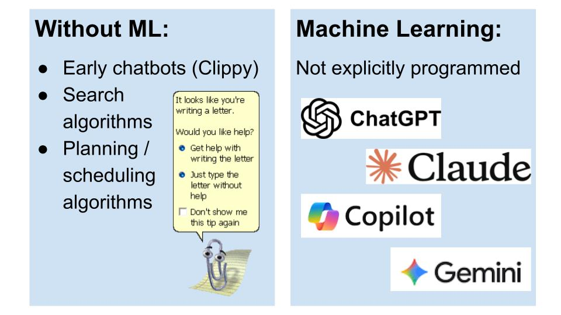
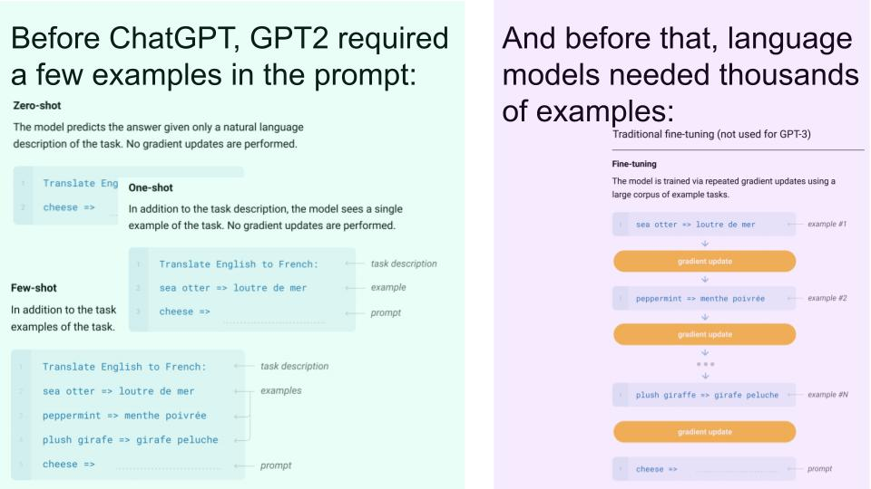
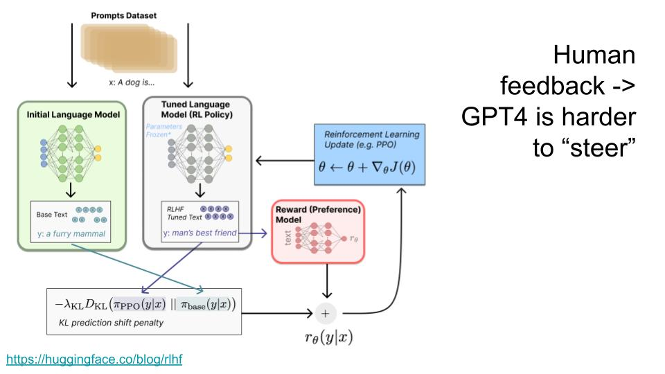
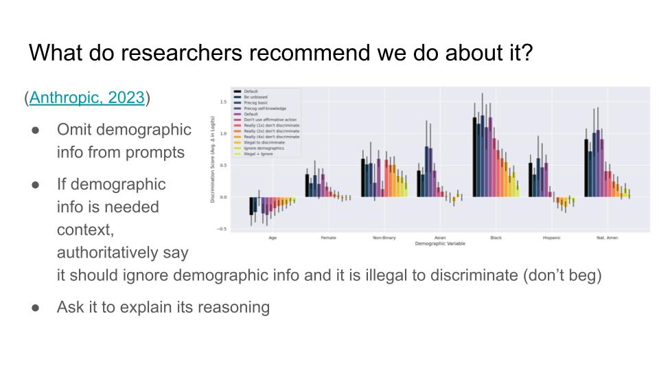

# AI Coding Assistants
## Welcome back to CS 2100!
## Prof. Rasika Bhalerao

---

---

---

---

---

---

---

---

---

---

---

---

---

---

---

---

---

---

---

## The rest of this lecture is summarized from research literature, blogs, and personal accounts.

https://scholarspace.manoa.hawaii.edu/items/d961b643-a1d6-4c57-80f4-2b2e86a8c134

https://dl.acm.org/doi/10.1145/3696630.3730566

https://ui.adsabs.harvard.edu/abs/2024arXiv240512195V/abstract

---

# Where do programmers code with AI?

## Web AI interface like claude.ai

- Good for generating a whole entire thing
- Less interactive experience

## In an IDE like VSCode with Github Copilot or Cursor

- Inline suggestions (extreme auto-complete) and chat interface
- Good for small parts of a large thing
- More interactive

## Command-line tool like Claude Code

- Runs from the terminal
- Executes multi-step tasks
- Can range from slightly interactive to completely autnomous

---

## Common concerns

- Concerns about over-reliance (self-reported by students)
- Hallucinations and incorrect information
- Security flaws
- Outdated information
- Access inequality (paid vs. free versions)
- Reduced deep comprehension for complex tasks
- Some studies show AI slows down developers (https://arxiv.org/pdf/2507.09089)

---

## Each task in the PDI process can use AI in some way:

### AI can help us do these efficiently, but it cannot replace human creativity and understanding of the codebase.

---

### [Research shows this is the standard workflow with AI that software developers are trending towards:](https://arxiv.org/abs/2506.00202)

1. **Identify** what domain-related information the AI needs
2. **Engage** with the AI through prompts that state the need as a structured request with specific information, context, the problem statement, and desired outcomes
3. **Evaluate** the AI output against domain knowledge, expected results, and other success criteria
   1. Often run and observe in a sandbox
4. **Calibrate** by providing the AI with feedback and additional context
5. **Tweak** the AI-generated artifacts to better fit standards
6. **Finalize** and write documentation including decisions and rationale

### This workflow can be used for any of the tasks in the PDI process

---

# Why we discourage "vibe coding" in the PDI sequence:

- "Vibe coding" is where you only evaluate the *execution* of the AI-generated code, and not the code itself
- Vibe coding leads to "productivity collapse"
- When we write code, we learn about how our codebase works (and about how to write better code)
- If we don't understand our own code, it's very hard to troubleshoot, give the right feedback to the AI, add to the codebase, etc.
- So we have the AI write its own brittle fixes
- This tends to spiral into branching dependencies where nobody understands how it works

---

## Common uses for the web interface

- Learning new syntax (for example, when using a new package)
- Explaining error messages to help debug
- Generating code
  - Generate initial code for a starting point, which you refine there or in an IDE
- Reviewing code
  - Find bugs we might have missed
  - Think of test cases we didn't consider
  - Make things more efficient / easier to read
- Translating between programming languages

#### We'll do most of these in an example (few slides later).

---

## Common uses for Cursor / Windsurf / Github Copilot IDE plugin

- Generate boilerplace code quickly (class with constructor, test class with setup, `if __name__ == '__main__'`, etc)
  - Especially if you already have examples using of how you prefer it in your codebase
- Figure out bugs that require understanding interaction between multiple files (using the IDE's chat feature)
- Make modifications that require modifying parts of multiple files
  - Context is any files you have open in the editor
- Suggest commands that you can choose to run in the IDE's built-in terminal

#### We'll also do most of these in an example (after the next poll).

---

## Poll: Why do we make sure to understand any code generated by AI?

1. Because we can't trust that it works the way we intended
2. Because we need to know how it works to troubleshoot later
3. Because code that we don't understand stacks up like debt
4. Because we learn to be better programmers that way

---

# Let's develop a game together using AI

**The game:**
- Each player is assigned a secret "target person" and "target word".
- Each player's goal is to get their target person to say the target word.
- If a player (Player A) succeeds in making their target person (Player B) say the target word, then Player B is "out," and Player A takes on Player B's target person and target word.
- The last player who is not "out" wins.

#### Let's go through _one_ example of how we might do this using AI.

---

# Requirements and Design

### Let's use claude.ai to determine:

- High-level behavior
  - How are users notified of their target player and target word?
  - How do users indicate that they got someone "out?"
- Which packages should we use?
  - (Let's stick to Python because we understand that)
- What might the UML diagram look like?

---

# Implementation

1. Let's have claude.ai generate a starting point using our design
2. Let's copy it over to VSCode, read it over, and use Github Copilot to write tests
   - Ask Github Copilot chat for help installing packages as needed
   - Tests will require more interaction to get right
3. Let's run it and come up with a tweak we want to make
4. Let's ask the Github Copilot chat in VSCode how to implement that tweak, and do it
5. Let's ask the Github Copilot chat for test cases we missed

---

## Common uses for Claude Code in the terminal

- Autonomously run commands in the terminal (installing stuff, running tests)
- Do multiple things at once (e.g., run commands and write code)
- Automate repetitive coding tasks
- Do Git stuff (commits, PRs, etc.)
- Refactor code accross entire codebases
- Write code that requires understanding dependencies / how many files interact
- Automate entire workflows like test-driven development
- Work for hours without human interaction (this scares Rasika but it is a common use)
- Split tasks and delegate specialized tasks to sub-agents
- Can run as a script in headless mode (no need for a terminal)

#### [Let's watch Anthropic's demo](https://www.youtube.com/watch?v=AJpK3YTTKZ4)

---

## Note: There's also a Claude Code VSCode extension (beta) that provides a graphical interface for Claude Code within VSCode, offering a middle ground with inline diff previews and one-click rollback while maintaining Claude Code's agentic capabilities.

---

# Poll:

# 1. What is your main takeaway from today?

# 2. What would you like to revisit next time?