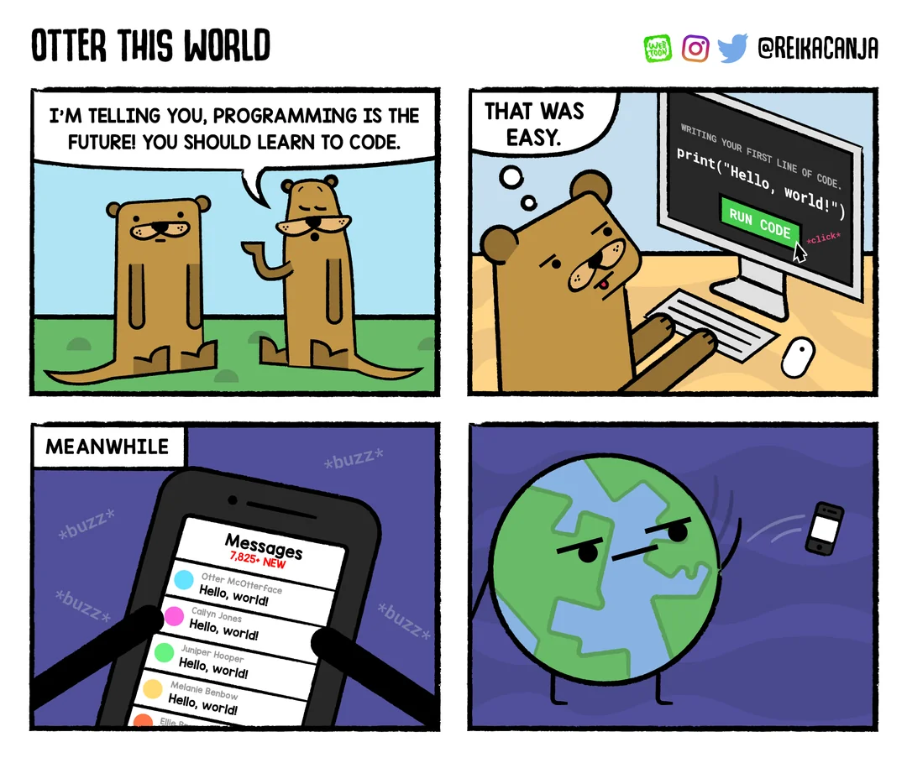

# Welcome to CS 2100: Program Design and Implementation

Prof. Rasika Bhalerao

---

# Rasika Bhalerao, Ph.D.

- (Asst.) Teaching Professor
- Likes:
  - Rock climbing
  - Meditation
- Research areas:
  - Ethical tech
  - Practical/applied AI
  - CS Pedagogy


---

# In-class participation

<!-- We will mostly use Poll Everywhere for in-class participation. -->

Helps students to:
- connect with each other
- learn the material more deeply
- let the instructor know about their understanding.

It is also worth a portion of the grade.

Try it out: https://pollev.com/rasika

Log in with your Northeastern account
(May need to log out of other account)


---

## Poll: What motivates you? (Choose your top 3)

<div class="grid grid-cols-2 gap-4">
<div>

- Grades
- Learning
- Preparing for job / co-op interviews
- Doing well in the job / co-op
- Doing well in later courses
- Making friends

</div>
<div>

- Letter of recommendation from instructor
- Enjoying college life
- Addressing societal issues
- Health and well-being

</div>
</div>

In-class exercises are graded on completion, not correctness.
(And there is no "correct answer" for this poll.)

---

# Course Structure

- 3 lectures and 1 lab per week​
- ~ weekly homework assignments​
- Four quizzes and a final exam
- Office hours and the discussion board

---

# The AI Policy

- No AI coding assistants like Cursor, Windsurf, and Copilot
- No chat models like ChatGPT, Claude, or Gemini
- Exception: the AI overview that appears when using a search engine like Google. You may use it to look up documentation, errors, concepts, etc.
- Instructor may ask to meet with the student and have them explain their code

## Open ended poll: How do you feel about the AI policy?

<!-- We believe that using an AI assistant is an important skill that should be covered after the basics (which is why there is a different policy in CS 3100). Using AI assistants before covering the basics would be like using a calculator before a course on arithmetic -- it would undermine your ability to review and understand code. Until you have the ability to design, understand, and review code, using an AI assistant amounts to wandering around in the dark, with no ability to determine if you are getting closer to what you want. (Using these tools to get decent grades while learning nothing is pretty clearly shooting yourself in the foot: you are in college to learn; if you end up unable to do anything but prompt engineer, you will have essentially no skills, given these models are intentionally rendering whatever "skill" underlying prompt engineering obselete in every generation). -->

<!-- Putting in assignment instructions into such a model and getting out code or test cases amounts to getting the model to do the thinking for you -- and as a result, you will not learn. "Only look"ing at AI-generated solutions "before writing your own" undermines the learning just the same, as you will not be learning to actually solve problems, you will just be copying (and, importantly, never developing the ability to recognize when the AI generated solution isn't what you want). If you have a question about whether something is allowed, we encourage you to ask an instructor, and you will not be penalized for asking. You may use AI language models for non-assignment-related things. -->

<!-- The exception is the AI overview that appears when using a search engine like Google. You may use a search engine to look up documentation, errors, concepts, etc. when doing assignments. We always encourage you to bring larger questions to our course staff, who will likely be able to give you better answers, more suited to your background, to our curriculum, etc. If you do use LLMs for search, you are responsible for validating any information you find. -->

<!-- Emerging research is beginning to show that substituting practice on fundamental skills by delegating that practice to LLMs significantly decreases learning. Whilst using an LLM might reduce the immediate strain of learning something new, it can also diminish the development of critical thinking skills by decreasing engagement and impeding independent problem-solving. Moreover, even the benefits of using LLMs for experienced developers have been questioned. LLMs can be useful useful once you have gained competence in program design and are able to break down a problem and specify it precisely—-which are the skills we are trying to develop in this course. -->

---

# Resources

- Pawtograder (https://app.pawtograder.com)
  - Office hours
  - Discussion board
  - Starting assignments (homework and labs)
  - Checking grades
- Git / GitHub: Submitting assignments
- Lecture notes (https://neu-pdi.github.io/cs2100-public-resources)
- Textbook: "Python 3 Object Oriented Programming: Harness the Power of Python 3 Objects" by Dusty Phillips
  - we will not follow it exactly

---

# Code-level Design Practices (style guidlines)

## Why enforce a Style Guide?

- Any code that we write will be read by at least one other person (probably more)
  - Sometimes that "other person" is actually ourselves, years in the future, attempting to use our old code.
- Many employers require code to be verified by at least two other people before it is accepted into the code base
- Helps other people to easily contribute to our codebase
- TA needs to read it to grade it

We use the "official" Python style guide, PEP8: https://peps.python.org/pep-0008

---

# Style: Variable naming conventions

Names of variables, functions, and modules use `snake_case`: words in lowercase, separated by underscores (_).

# Pylint

Pylint (https://marketplace.visualstudio.com/items?itemName=ms-python.pylint) checks that our code follows the style guidelines.

Please set up the Pylint VSCode extension using the steps in the [Setup Guide](https://neu-pdi.github.io/cs2100-public-resources/setup).

---

# Python code with types

Your classmate wants help finding a bug in their code:

```python
def get_area_of_rectangle(width, height):
    return width * height

width = '3'
height = 4

result = get_area_of_rectangle(width, height)

print(f'Area of a {width} by {height} rectangle: {result}')
```

Its output is `Area of a 3 by 4 rectangle: 3333`, which is false.

---

## Unconvinced? How about this code:

```python
num1 = input('Please enter a number: ')
num2 = input('Please enter another number: ')
print(num1 + num2)
```

It says that 3 + 5 is 35. We'll revisit that in a bit.

---

## Python:
- strongly typed language (variables have types)
- dynamically typed language (checks the types for consistency at run time, not compile time)

## We love Python, but...
this makes it hard for introductory learners, and hard to catch bugs in code generated by someone else.

---

# Python supports putting types in code

```python
def get_area_of_rectangle(width: int, height: int) -> int:
    return width * height

width: int = '3'
height: int = 4

result: int = get_area_of_rectangle(width, height)

print(f'Area of a {width} by {height} rectangle: {result}')
```

Python does not enforce the types. (The above code runs exactly the same as before, even after adding the types.)

So we use MyPy to enforce the type checking.

---

# MyPy

Please set up the MyPy VSCode extension using the steps in the [Setup Guide](https://neu-pdi.github.io/cs2100-public-resources/setup).

Missing or mismatched types will be reported in the "Problems" tab every time you save or open a file:
- Mac: Cmd + Shift + M
- Windows: Ctrl + Shift + M

---

# MyPy

If MyPy is set up properly, then this code:

```python
def add(num1: int, num2) -> int:
    return num1 + num2

result: str = add(3, 'hi')

def func() -> int:
    pass
```

should result in three errors:
1. `num2`'s missing type
2. `add()`'s returning something other than the promised `int`
3. `result`'s value being an `int` when the variable type is `str`

---

If MyPy is set up properly, then this code:

```python
def add(num1: int, num2) -> int:
    return num1 + num2

result: str = add(3, 'hi')

def func() -> int:
    pass
```

If there is an error about `func()` missing a return, then the arg `--disable-error-code=empty-body` was not specified correctly in the settings.

---

## Back to the example where 3 + 5 is 35:

```python
num1: int = input('Please enter a number: ')
num2: int = input('Please enter another number: ')
print(num1 + num2)
```

Adding the types for `num1` and `num2` prompted MyPy to remind us that the `input()` function returns a `str`, not an `int`.

---

# Functions require documentation and tests

Write tests to ensure our code works, but also to convince _others_ that our code works.

Each function's documentation must include:
- All parameters
- Any returns
- Any errors or exceptions that might be raised

Formatting the documentation properly makes it show up in official places like `str.__doc__` and `help(str)`.

---

```python
def get_area_of_rectangle(width: int, height: int) -> int:
    """Returns the area of a rectangle.

    Parameters
    ----------
    width : int
        The width of the rectangle
    height : int
        The height of the rectangle
    
    Returns
    -------
    int
        The area of the rectangle

    Raises
    ------
    ValueError
        If width or height is negative
    """
    if (width < 0 or height < 0):
        raise ValueError("Rectangle dimensions cannot be negative")
    return width * height
```

---

(Same file, continued)

```python
class TestArea(unittest.TestCase):
    """Tests for the function get_area_of_rectangle(width: int, height: int) -> int"""

    def test_3_by_4(self) -> None:
        """3 by 4 rectangle"""
        self.assertEqual(12, get_area_of_rectangle(3, 4))

    def test_negative_area(self) -> None:
        """Make sure it raises a ValueError for a negative width"""
        with self.assertRaises(ValueError):
            get_area_of_rectangle(-1, 4)


if __name__ == '__main__':
    unittest.main()
```

---

# Why Python?

## It's popular

- Employers
- Interviews
- Hundreds of thousands of public Python packages
- Popular among data scientists, web developers, game developers, machine learning engineers, and many others
- Many online resources for learning Python

<!-- The next course in this sequence (CS 3100: PDI2) will use Java, another widely popular language. While our current course (CS 2100: PDI1) covers object-oriented programming, and most object-oriented concepts can be achieved in Python, we know that some object-oriented concepts are better taught in Java, and they will be covered next semester instead. We will learn Python in a way that sets students up for success next semester by, for example, requiring types in the code. -->

---

<!-- footer: Source: https://www.reddit.com/r/ProgrammerHumor/comments/64s93u/hello_world_oc -->



---

# Poll:

# 1. What is your main takeaway from today?

# 2. What would you like to revisit next time?